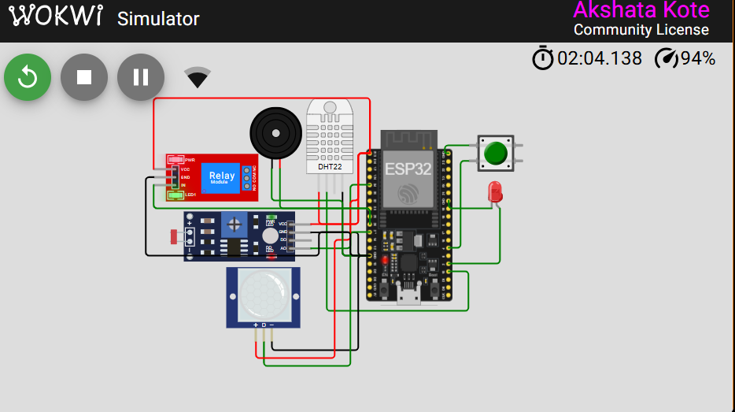
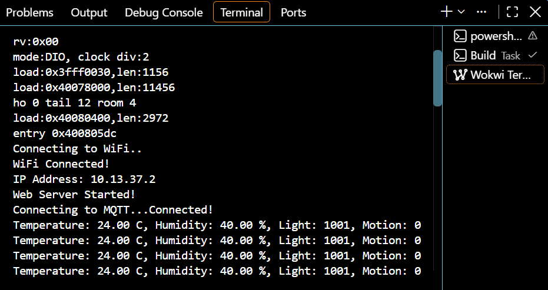
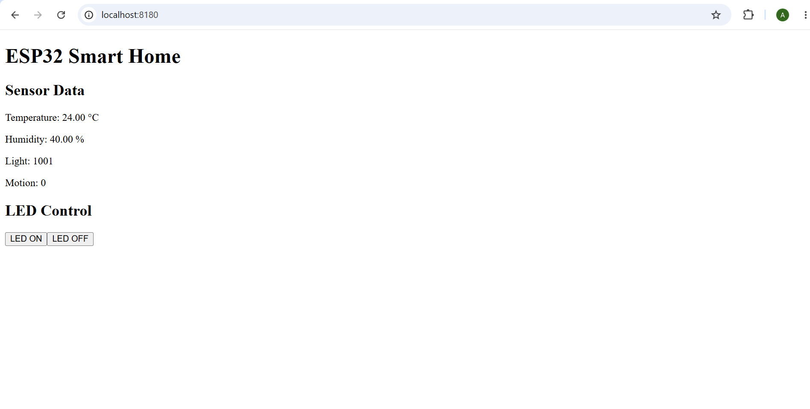
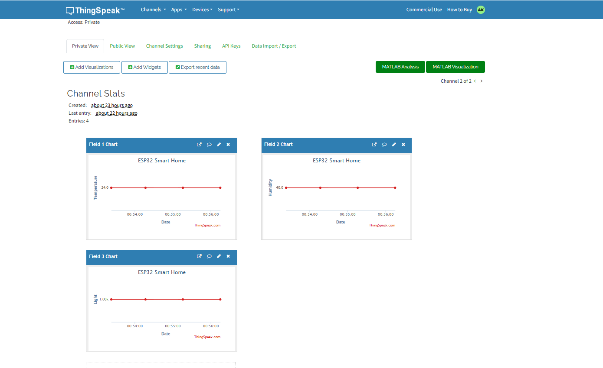
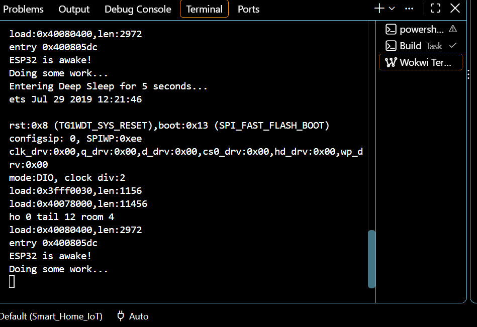

# ESP32 Smart Home IoT

Wi-Fi Enabled Smart Home Monitoring and Control System using ESP32.

## Project Overview

This project demonstrates an ESP32-based smart home system using Wokwi simulation. It collects sensor data, communicates using MQTT, uploads data to ThingSpeak, and provides browser-based monitoring and LED control.

## Features

- ESP32 programming
- Wi-Fi connectivity
- DHT22 temperature and humidity monitoring
- LDR light monitoring
- PIR motion detection
- LED control
- Relay control
- Buzzer alert
- MQTT communication
- ESP32 web server
- ThingSpeak cloud monitoring
- Deep sleep demonstration

## Hardware Components

- ESP32
- DHT22 sensor
- LDR sensor
- PIR sensor
- LED
- Push button
- Relay module
- Buzzer

## Software and Tools

- PlatformIO
- Visual Studio Code
- Wokwi
- Arduino Framework
- MQTT
- ThingSpeak
- Git and GitHub

## Working

1. ESP32 connects to Wi-Fi.
2. Sensors collect temperature, humidity, light and motion data.
3. Sensor data is published using MQTT.
4. Sensor values are uploaded to ThingSpeak.
5. ESP32 provides a web interface for monitoring and LED control.
6. Relay and buzzer respond according to sensor conditions.
7. Deep sleep is demonstrated for power-saving operation.

## Simulation

The project was developed and tested using Wokwi ESP32 simulation.

## Project Screenshots

### Final Wokwi Circuit

### Wi-Fi and MQTT Output

### Web Server Control

### ThingSpeak Cloud

### Deep Sleep

